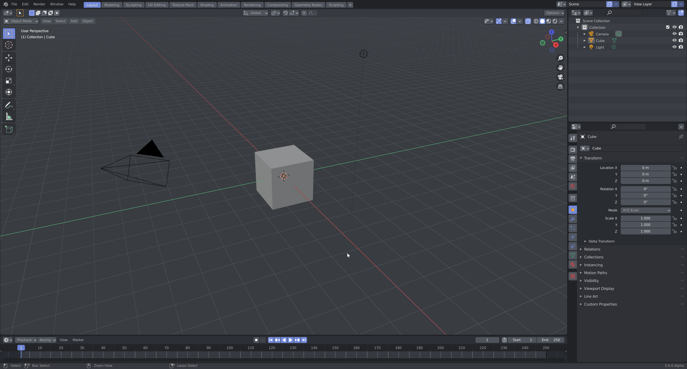
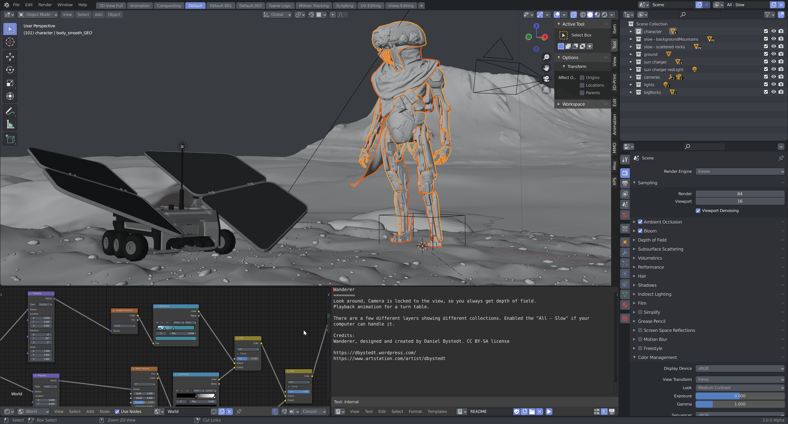

# Blender Discord Theme
Blender theme with [Discord's](https://discord.com) color palette.

## Screenshots

## Install
* Open Blender Preferences **(Edit > Preferences)**
* Select the **Themes tab** and click Install…
* Select **discord.xml** and click **Install Theme**

Required: [Blender 2.8](https://www.blender.org/download/)

Join the [Development Fund](https://fund.blender.org) and support Blender Foundation to work on core Blender development.
